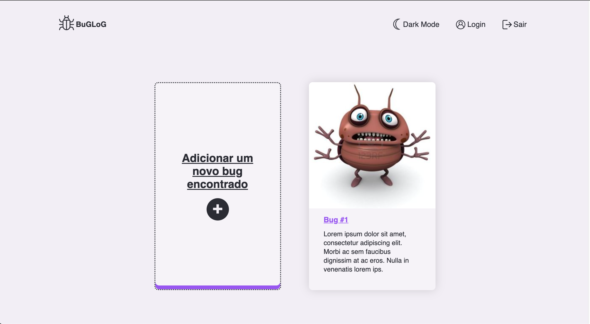
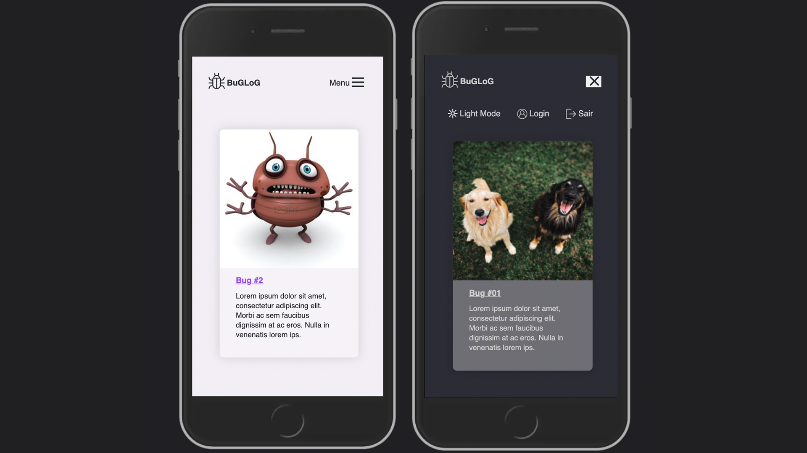
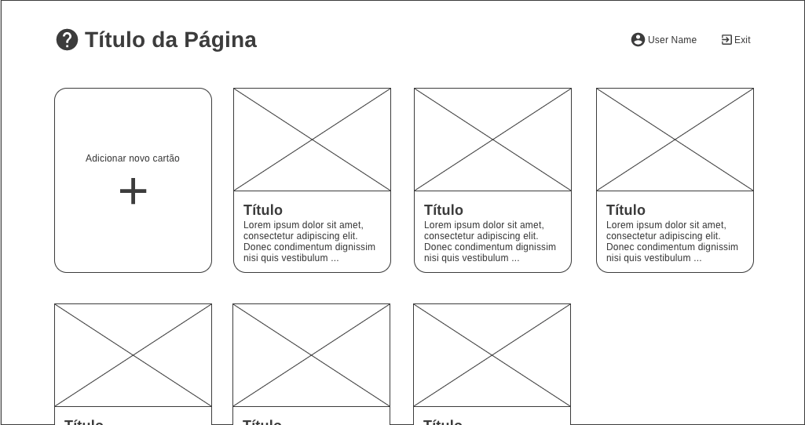
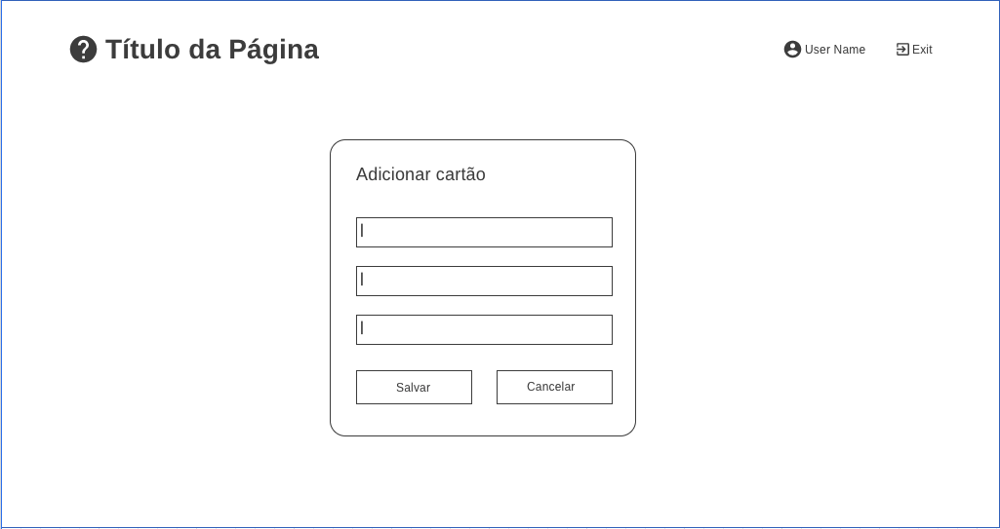

# buglog
This is purely a study project, good for mastering the fundamentals of DOM manipulation using native features of modern Javascript, HTML5 and CSS3.

The application consists of a backlog that creates and deletes cards, using modal, form, input validation, event listeners, toogle modes, counter, animations and so on. 

<hr>

### Demo:
<a href="https://tuliopxavier.github.io/buglog/" target="_blank">tuliopxavier.github.io/buglog/</a>

<hr>




<hr>

### Wireframes


<hr>

### To test
- Clone repo: ```git clone https://github.com/tuliopxavier/aluracord.git```
- On ```index.html```, run Live Server extension (for VSCode) or similar.

<hr>

### Technologies
- HTML
- CSS
- Javascript

<hr>

### 🤝 To contribute
- Fork this project.
- Create a branch ```git checkout -b <name of new branch>```
- After making your contribution to the source code, stage your changes in ```git add .```
- Commit the new implementations ```git commit -m '<description of what the commit does>'```
- Push implementations to this new branch ```git push origin <new branch name>```
- Go back to your *forked* github repository and click ```compare & pull request```

Or simply open an issue describing your thoughts or observations.

Feel free to copy and modify whatever you want. Keeping knowledge free transforms our community for the better, we inspire and create a more welcoming future.
